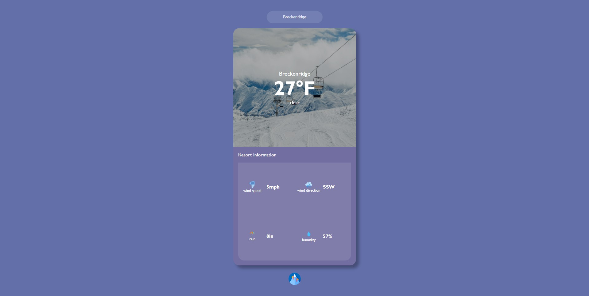

# Ski Resort Weather

This is an Angular project that allows users to check the weather conditions of ski resorts. The application shows the name of the resort, the maximum temperature for the current hour, and a short summary of the weather. Users can search for any resort by typing its name in the search bar. The application also provides information about wind speed, wind direction, rain depth, and humidity.

## Getting Started

To view this application, head over to: https://skiresortweather.web.app/

## Using the Application

To search for a ski resort, simply type its name in the search bar and hit enter. The application will try to match your input to the closest resort name in the database. If there's a misspelling or typo, the application will take a guess and choose the resort it thinks you want.

## Contributing

If you'd like to contribute to this project, you're welcome to submit pull requests or open issues on the GitHub repository: https://github.com/KevinDiepSWE/ski-resort-weather

